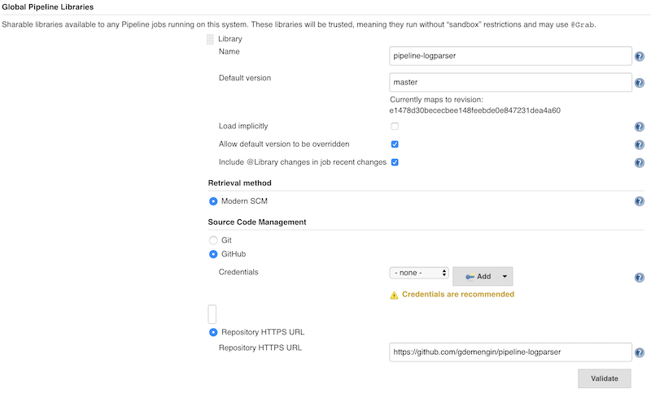

# pipeline-logparser
a library to parse and filter logs
  * implementation of https://stackoverflow.com/a/57351397
  * workaround for https://issues.jenkins-ci.org/browse/JENKINS-54304

## change log

* 1.0 (09/2019) first version:
  - API to parse logs and retrieve maps of id/offsets/branchname
  - API to get edited logs with branchName (with nested branches, without VT100 markups, etc ...)
  - API to filter logs by branch name (get logs of a specific branch)

* 1.0.1 (11/2019)
  - fix parsing issues (when there is only one branch and when logs of 2 branches are mixed without pipeline technical logs in between)

## content
it allows
- to add branch prefix [branchName] in front of each line of the logs belonging to a parallel branch

  ```
  parallel(
    branch1: {
      echo 'in branch1'
      sleep 1
    },
    branch2: {
      echo 'in branch2'
      sleep 1
    }
  )
  ```

  > [Pipeline] Start of Pipeline  
  > [Pipeline] parallel  
  > [Pipeline] { (Branch: branch1)  
  > [Pipeline] { (Branch: branch2)  
  > [Pipeline] echo  
  > **[branch1]** in branch1  
  > [Pipeline] sleep  
  > **[branch1]** Sleeping for 1 sec  
  > [Pipeline] echo  
  > **[branch2]** in branch2  
  > [Pipeline] sleep  
  > **[branch2]** Sleeping for 1 sec  
  > [Pipeline] }  
  > [Pipeline] }  
  > [Pipeline] // parallel

- to filter logs by branchName

  > **[branch1]** in branch1  
  > **[branch1]** Sleeping for 1 sec

- to show name of parent branches (parent branch first) for nested branches

  ```
  parallel(
    branch1: {
      echo 'in branch1'
    },
    branch2: {
      echo 'in branch2'
      parallel(
        branch21: {
          echo 'in branch2.branch21'
        },
        branch22: {
          echo 'in branch2.branch22'
        }
      )
    }
  )
  ```

  > [Pipeline] Start of Pipeline  
  > [Pipeline] parallel  
  > [Pipeline] { (Branch: branch1)  
  > [Pipeline] { (Branch: branch2)  
  > [Pipeline] echo  
  > [branch1] in branch1  
  > [Pipeline] }  
  > [Pipeline] echo  
  > [branch2] in branch2  
  > [Pipeline] parallel  
  > [Pipeline] { (Branch: branch21)  
  > [Pipeline] { (Branch: branch22)  
  > [Pipeline] echo  
  > **[branch2] [branch21]** in branch2.branch21  
  > [Pipeline] }  
  > [Pipeline] echo  
  > **[branch2] [branch22]** in branch2.branch22  
  > [Pipeline] }  
  > [Pipeline] // parallel  
  > [Pipeline] }  
  > [Pipeline] // parallel

- to archive logs in job artifacts (without having to allocate a node : same as ArchiveArtifacts but without `node()` scope)

- to hide or show VT100 markups from raw logs

- to access descriptors of log and branches internal ids

## installation

install it as a "Global Pipeline Library" in "Manage jenkins > Configure System > Global Pipeline Library" (cf https://jenkins.io/doc/book/pipeline/shared-libraries/)



Note:
  * it's also possible to copy the code in a Jenkinsfile and use functions from there
  * but it would imply approving whatever needs to be in "Manage jenkins > In-process Script Approval" (including some unsafe API's)
  * using this library as a "Global Pipeline Library" allows to avoid that (avoid getting access to unsafe API's)

## usage:

### import logparser library
in Jenkinsfile import library like this
```
@Library('pipeline-logparser@1.0.1') _
```
  * identifier "pipeline-logparser" is the name of the library set by jenkins administrator in configuration: it may be different on your instance

### use logparser functions:

* `void archiveLogsWithBranchInfo(String name, java.util.LinkedHashMap options = [:])`

  archive logs (with branch information) in run artifacts

* `String getLogsWithBranchInfo(java.util.LinkedHashMap options = [:])`

  get logs with branch information

* available options:
  * `filter = null` : name of the branch to filter

  * `showParents = true` : show name of parent branches

    example:  
    > **[branch2]** [branch21] in branch21 nested in branch2

  * `markNestedFiltered = true` : add name of nested branches filtered out

    example:  
    > [ filtered 315 bytes of logs for nested branches: branch2.branch21 branch2.branch22 ] (...)

  * `hideVT100 = true` : hide the VT100 markups in raw logs

    cf https://www.codesd.com/item/how-to-delete-jenkins-console-log-annotations.html  
    cf https://issues.jenkins-ci.org/browse/JENKINS-48344

* examples:
  * archive full logs as $JOB_URL/&lt;runId&gt;/artifacts/consoleText.txt:

    ```logparser.archiveLogsWithBranchInfo('consoleText.txt')```

  * get full logs:

    ```String logs = logparser.getLogsWithBranchInfo()```

  * get logs for branch2 only:

    ```String logsBranch2 = logparser.getLogsWithBranchInfo(filter: 'branch2')```

  * get logs for branch2 without parents or nested branches markups:

    ```String logsBranch2 = logparser.getLogsWithBranchInfo(filter: 'branch2', markNestedFiltered: false, showParents: false)```

  * archive logs for branch2 without parents or nested branches markups:

    ```logparser.archiveLogsWithBranchInfo('logsBranch2.txt', [filter: 'branch2', markNestedFiltered: false, showParents: false])```

  * get full logs with VT100 markups:

    ```String logs = logparser.getLogsWithBranchInfo(hideVT100: false)```


## known limitations:

* parsing may fail (and cause job to fail) when log is too big (millions of lines, hundreds of MB of logs) because of a lack of heap space

* if logparser functions are called too early the last lines of logs might not be flushed yet and shall not be in the resulting log
  workaround: before to call logparser add these 2 statements
  ```
  // sleep 1s and use echo to flush logs before to call logparser
  sleep 1
  echo ''
  ```
  example:  
  ```
  @Library('pipeline-logparser@1.0.1') _

  parallel(
    branch1: {
      echo 'in branch1'
    },
    branch2: {
      echo 'in branch2'
    }
  )

  // sleep 1s and use echo to flush logs before to call logparser
  sleep 1
  echo ''

  logparser.archiveLogsWithBranchInfo('console.txt')
  ```
  NB: this might not always be enough  

* the output is not fully equivalent to what we had with job-workflow plugin v2.25 and earlier :
  * pipeline code

    ```
    parallel(
      branch1: { echo 'in branch1' },
      branch2: { echo 'in branch2' }
    )
    ```
  * job-workflow plugin v2.25 output:

    > [Pipeline] parallel  
    > [Pipeline] **[branch1]** { (Branch: branch1)  
    > [Pipeline] **[branch2]** { (Branch: branch2)  
    > [Pipeline] **[branch1]** echo  
    > [branch1] in branch1  
    > [Pipeline] **[branch1]** }  
    > [Pipeline] **[branch2]** echo  
    > [branch2] in branch2  
    > [Pipeline] **[branch2]** }  
    > [Pipeline] // parallel  
    > [Pipeline] End of Pipeline

  * output using `logparser.getLogsWithBranchInfo()`:

    > [Pipeline] Start of Pipeline  
    > [Pipeline] parallel  
    > [Pipeline] { (Branch: branch1)  
    > [Pipeline] { (Branch: branch2)  
    > [Pipeline] echo  
    > [branch1] in branch1  
    > [Pipeline] }  
    > [Pipeline] echo  
    > [branch2] in branch2  
      
    So we lose a bit of information: the lines starting with `[Pipeline]` and which belonged to a specific branch like `[Pipeline] [branch2] echo`  
    It might not be the most important information but sometimes it is useful to know which branch it belongs to

